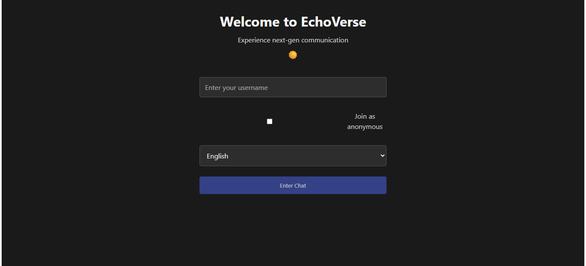

# 🔌 Real-Time Chat App — Socket.IO + React + Node

A real-time chat application built using **Socket.IO**, **React**, and **Node.js** for instant messaging, typing indicators, anonymous mode, and dynamic room support.

---

## 📦 Features

- ✅ Real-time messaging using Socket.IO
- 👥 Anonymous/visible user toggle
- 💬 Multiple room support (ephemeral & persistent)
- ⏰ Typing indicators
- 🌍 Live language translation
- 💡 Sentiment detection with mood-based message coloring
- ⚠️ Room expiry with system notifications
- 🔔 Join/leave notifications in real time

---

## 🧠 Tech Stack

| Frontend            | Backend             | Realtime            |
|---------------------|---------------------|---------------------|
| React, Vite, Tailwind CSS | Node.js, Express     | Socket.IO            |

---

## 🗂 Project Structure

socketio-chat/
├── client/ # React front-end
│ ├── public/ # Static assets
│ ├── src/ # App logic
│ │ ├── components/ # UI components
│ │ ├── context/ # React context (SocketContext)
│ │ ├── hooks/ # Custom hooks
│ │ ├── pages/ # Pages like ChatPage.jsx
│ │ ├── socket/ # socketClient.js setup
│ │ └── App.jsx # Root component
│ └── package.json # React dependencies
├── server/ # Node.js backend
│ ├── socket/ # socketManager.js logic
│ ├── utils/ # translate, sanitize, etc.
│ ├── server.js # Express + Socket.IO server
│ └── package.json # Backend dependencies
└── README.md # This file

## 🚀 Getting Started

### 1. Clone your repo

```bash
git clone https://github.com/YOUR_USERNAME/socketio-chat.git
cd socketio-chat

2. Install dependencies
Client (React)
cd client
npm install

Server (Node.js)
cd ../server
npm install

3. Create .env file in /server
CLIENT_URL=http://localhost:3000
PORT=5000
🧪 Run the App Locally
In two terminals:


💡 Advanced Features Implemented
Feature	Description
✨ Anonymous Mode	
🌍 Live Translation
🧠 Mood Detection
🧾 Typing Indicator
🕓 Room Expiry
⚠️ Safe Serialization

🖼 Screenshots
## 🖼 Chat UI Preview

## 🖼 Chat UI Preview



📄 License
This project is licensed for educational use under the MIT License.

👨‍💻 Created By
MellonP | Socket.IO Realtime Messaging Assignment | July 2025

